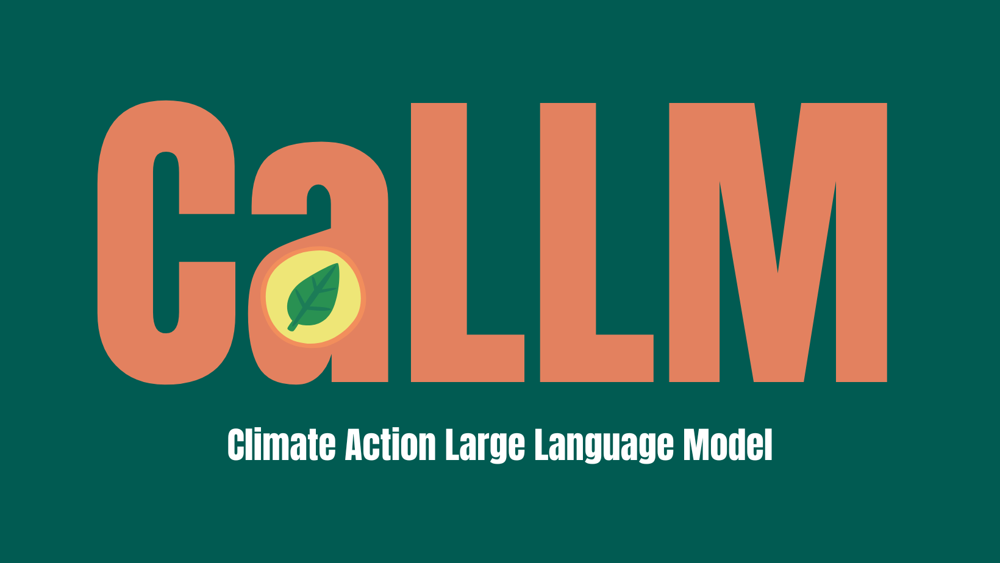

###

  

###

<h1 align="left">CaLLM Server and Plug-in</h1>

###

This is the implementation of my CS4098 Minor Software Project that provides the server and a Word Press plug-in front-end for a climate conscious chat bot that can be given specialised knowledge by adding to the information repository it is using to answer questions in an informed way.  It uses ggerganov's llama.cpp quantised model as the LLM and the Retrieval Augmented Generation (RAG) technique to provide context specific information. Langchain, Hugging Face and Pinecone are used to build the RAG chain.   

###

<h2 align="left">Pre-Requisits</h2>

###

Python3 Git

###

<h2 align="left">Llama Model Set-up</h2>

###

To run the guide, we need to have a quantised version of Meta's Llama2 LLM locally. To do this, clone the following two repositories into the caLLMServer directory:  1. git clone https://github.com/facebookresearch/llama.git 2. git clone https://github.com/ggerganov/llama.cpp.git  With both of these repositories cloned, navigate into llama.cpp and run the make command: make.  Next we want to request permission to access the Llama model by filling in the following form: https://ai.meta.com/resources/models-and-libraries/llama-downloads/  When you receive an email from Meta with the unique download URL, copy this.  Follow the next steps to install and quantize your llama model: 1. Navigate into the llama repository 2. Run the download script: /bin/bash ./download.sh using your unique URL when asked for it 3. Specify the models you want to download (I recommend 13b-chat for this projects purposes) 4. Navigate to llama.cpp repository 5. Create a venv: python3 -m venv llama2 6. Activate venv: source llama2/bin/activate 7. Install requirements: python3 -m pip install -r requirements.txt 8. Convert the model to f16 format (the following command is for the 13b-chat model): python3 convert.py --outfile models/13B/ggml-model-f16.bin --outtype f16 ../../caLLMServer/llama/llama-2-13b-chat --vocab-dir ../../caLLMServer/llama 9. Quantize the model:  ./quantize  ./models/13B/ggml-model-f16.bin ./models/13B/ggml-model-q4_0.bin q4_0  Create a directory in the /caLLMServer directory called /model. Move the ggml-model-q4_0.bin q4_0 file into the model directory in /climateGuide.  The llama and llama.cpp directories can now be deleted.  Your local Llama model is now ready to use!

###

<h2 align="left">Word Press Plug-in</h2>

###

The WP Plug-in is stored in the directory \CaLLMPlugin. This can be zipped and uploaded to a Word Press site as a plug-in and included as shortcode.   Ensure that you change the query.php file to point to your server.

###

  

###

<h2 align="left">Environment Variables</h2>

###

Open the .env file using your preferred text editor and add your versions of the following environment variables into the .env file:  HUGGINGFACEHUB_API_TOKEN = (Your Hugging Face Hub API key) HF_EMBEDDINGS_MODEL_NAME = (The Hugging Face model embeddings name you want to use)  PINECONE_API_TOKEN = (Your Pinecone vector database API key)  PINECONE_ENV = (The Pinecone environment of your vector database) PINECONE_INDEX_NAME = (The index of the Pinecone vector database)  ADMIN_PASSWORD = (Your admin password for adding information to the repository)  SERVER_PORT = (The server port number to run the back end)

###

<h2 align="left">Server Running Guide</h2>

###

1. Navigate to /caLLMServer directory 2. Activate venv: source bin/activate 3. Install requirements: python3 -m pip install -r requirements.tx 4. Run server: python3 app.py

###
